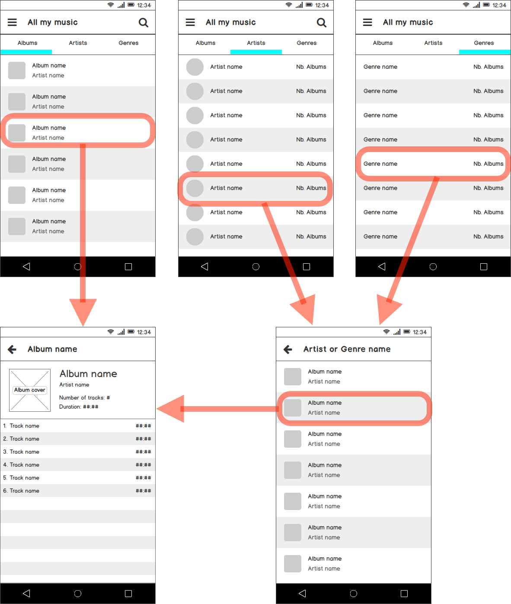

# Mini-Projet Android Avril 2016

  * Durée : 2 jours ; du Mercredi 27 Avril 2016 à 8h15 au Jeudi 28 Avril 2016 à 17h45.
  * Lieu : en B18
  * Supports autorisés : tous (e-learning, supports de cours, Internet)
  * Limites : Aucune forme de communication interpersonnelle (oral, chat, email, forum, …)

## Le sujet en bref

Si l'indice du rattrapage de WebServices n'était pas assez clair, il s'agit de créer une application Android à peu de choses près identique au catalogue musical que vous avez eu à réaliser pour iOS en Décembre dernier.

## Plagiat

Le travail que vous livrerez doit être le votre et exclusivement le votre. Vous pouvez *emprunter* du code provenant de guides trouvés sur le Web à condition que les commentaires indiquent clairement l'origine du code.

## Format du rendu

Le rendu se fait via Github ; il s'agit de votre code source versionné. Pour cela vous devez :

  * avoir un compte Github (au besoin créez-en un avec votre adresse @imerir.com)
  * suivre les instructions qui vous seront présentées au lien suivant [https://classroom.github.com/assignment-invitations/b986c8e1765f2d8f65f555f9f2caea87](https://classroom.github.com/assignment-invitations/b986c8e1765f2d8f65f555f9f2caea87)

Ce lien va créer un dépôt de fichiers dont vous serez le propriétaire et auquel le correcteur aura accès.

L'usage de [GitHub Desktop](https://desktop.github.com) ou de [SourceTree](http://sourcetreeapp.com/) est recommandé.

Il est très important que votre travail soit (très régulièrement) versionné. La granularité et la fréquence des commits sera prise en compte par le correcteur afin de suivre votre développement. Idéalement, sauf le commit initial et les XML de layout, aucun commit ne devrait dépasser 30 lignes. L'idée : dès que vous finissez une *phrase* ou un *paragraphe*, faites un commit (avec un commentaire pertinent).

## Description de l'application à réaliser

Vous devez réaliser une application de catalogue musical dont voici le mockup :

### Source de données

Le sujet utilise le même Web Service que vous avez réalisé Lundi après-midi en rattrapage. L'implémentation de référence est disponible à cette fin. Il est cependant recommandé que dans un premier temps vous travailliez en *dur* afin d'assoir les transitions entre vos activités.

**Attention à la persistance des données :** votre application doit continuer à fonctionner lorsque vous n'avez pas accès au réseau. Il est donc important que vous gardiez une copie locale des données téléchargées du WebService. Pour cela **vous utiliserez Realm**.

#### Ajouts par rapport au partiel de WebService

La ressource `Track` (piste d'un album) a été ajoutée. Celle-ci n'était pas présente dans le sujet du partiel Lundi après-midi. Par ailleurs, le mockup suppose que l'on puisse récupérer tous les albums. Le sujet de Lundi ne prévoyait pas cela. Ces *oublis* permettaient que le sujet reste réalisable dans le temps imparti.

Donc aux chemins suivants :

  * `/genres`  
    Liste des genres.
  * `/genres/<gid>`  
    Un genre.
  * `/artists`  
    Liste des artistes.
  * `/artists/<pid>`  
    Un artiste.
  * `/artists/<pid>/albums`  
    Liste des albums d'un artiste.
    
On en ajoute les chemin suivants :

  * `/albums`  
    Liste des albums.
  * `/albums/<aid>`  
    Un album en particulier.
  * `/albums/<aid>/tracks`  
    Liste des pistes d'un album.

La ressource album reste inchangée ; on ajoute par contre la description d'une piste : 

    TRACK := {
      "title": STRING,
      "duration": INT
    }

#### Liens utiles

  * [http://mysterious-thicket-90159.herokuapp.com/](http://mysterious-thicket-90159.herokuapp.com/)
  * [Sujet Partiel WebService](https://e-learning.imerir.com/mod/page/view.php?id=9939)

### Points optionnels

  * Le filtre de recherche présent en haut à doite sur les écrans `All my music / Albums` et `All my music / Artists` est un bonus.
  * L'écran `All my music / Genres` n'est pas requis ; néanmoins sa présence améliorera votre note.

## TODO et attentes

  - [ ] Créer un dépôt Github à partir de [l'invitation](https://classroom.github.com/assignment-invitations/b986c8e1765f2d8f65f555f9f2caea87)
  - [ ] Créer un projet Android dans le clone du dépôt
  - [ ] Reproduire le mockup dans une application Android native
    - le filtre de recherche et la page Genres sont des bonus
  - [ ] Alimenter les données à partir du WebService
  - [ ] Penser à garder une copie locale des données avec Realm pour un accès hors ligne (*"mode avion"*)
  - [ ] L'affichage des images (photo d'album et d'artiste) est souhaité mais, à choisir, la persistance des données avec Realm est préférée.

## Version de Android Studio

Pour votre confort, il est recommandé que vous utilisiez la [version 2.x](http://developer.android.com/sdk/index.html).

## Questions ?

Si vous avez des questions : [pierre.grabolosa@imerir.com](mailto:pierre.grabolosa@imerir.com) ou Skype (voir e-learning).

Par ailleurs, j'essaierai d'être présent physiquement :

  * Mercredi je serai en cours avec l'IFA Delorozoy. J'essaierai néanmoins de passer à la pause de midi et de l'après-midi.
  * Jeudi je serai en cours à l'Imérir ; si besoin je peux être visité (voir planning des 2A pour le numéro de salle).

